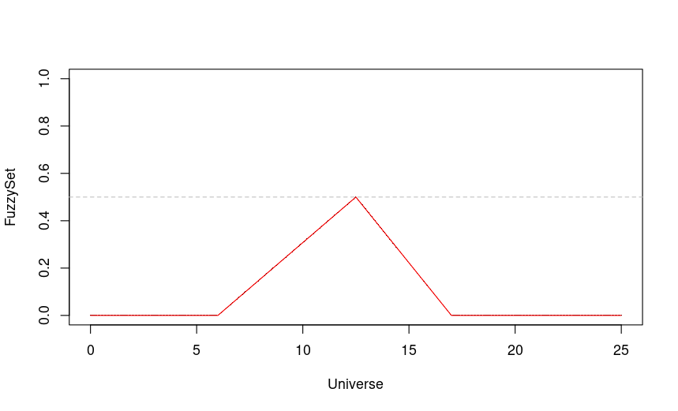

# FuzzyRules


## 1. Como ler os arquivos

### 1.1 Fuzzy Tipo I

```
library(devtools)
source_url("https://raw.githubusercontent.com/leapigufpb/FuzzyRules/main/FuzzySets.R")
```

### 1.2 Fuzzy Tipo II

```
library(devtools)
source_url("https://raw.githubusercontent.com/leapigufpb/FuzzyRules/main/FuzzySetsTypeII.R")
```

----

## 2. Exemplo de utilização

```
Em construção...
```


----

## 3. Parâmetros adicionados


### 3.1 Criação de Listas

Foi criado a função `listfuzzy` que recebe uma lista, e cria uma forma recorrente de adição de listas. Por exemplo, na primeira utilização, é adicionado a primeira lista, na segunda utilização, informa a função, o nome da variável e a segunda lista a ser adicionada:

```
# Alocando a primeira lista '(fr1)' e salvando em 'Out_Rules_Lst'
Out_Rules_Lst <- listfuzzy(fr1)

# Alocando da segunda lista '(fr2)' em diante
Out_Rules_Lst <- listfuzzy(Out_Rules_Lst,fr2)
```


### 3.2 Altura máxima do alpha

- Nas funções `TriFS` e `TraFS` foi adicionado um parâmetro denominado `alphamax`. Esse parâmetro é responsável para definir a altura máxima do alpha,
ou seja um triangulo com parâmetros (6, 12.5, 17) gerado com `alphamax = 0.5` produz uma saída como mostrado abaixo



Esse parâmetro é importante na utilização do fuzzy tipo II, em que a função interna não necessariamente deve possuir o alpha máximo como valor 1.

> O valor padrão do parâmetro alphamax é 1.

----

## 4. Arquivos de Exemplo

- **Exemplo_de_Utilizacao.R** - Exemplo para fuzzy tipo I
(https://raw.githubusercontent.com/leapigufpb/FuzzyRules/main/Exemplo_de_Utilizacao.R)

- **Exemplo_de_Utilizacao_Fuzzy_Tipo_II.R** - Exemplo para fuzzy tipo II
(https://raw.githubusercontent.com/leapigufpb/FuzzyRules/main/Exemplo_de_Utilizacao_Fuzzy_Tipo_II.R)